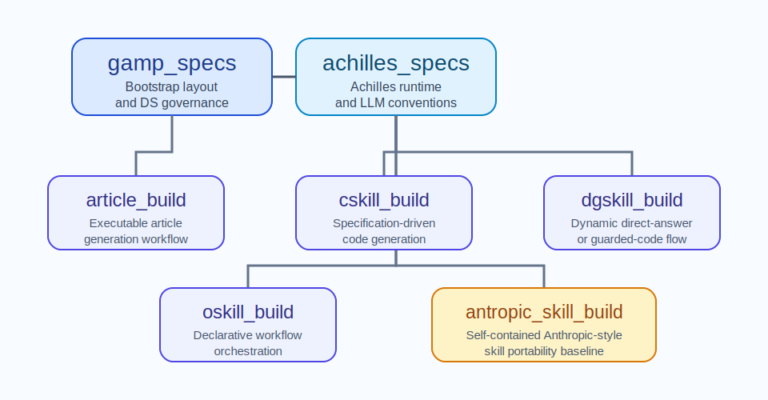

# DS000 Vision

## Introduction

This repository exists to provide a standardized, reusable baseline of self-contained skills for the team and for downstream projects that use Achilles, our libraries, and our technologies. Its purpose is to bootstrap project structure, runtime conventions, skill-family authoring guidance, and repository review practices without coupling each skill to the host project's internal source tree.

## Core Content

The repository must preserve a layered skill model. `gamp_specs` defines repository bootstrap and documentation rules. `achilles_specs` defines AchillesAgentLib and runtime-configuration conventions. The remaining skills define reusable families or executable workflows. The repository must expose those layers consistently through `README.md`, `AGENTS.md`, `docs/index.html`, and the DS matrix.

The repository must remain ready to host more skill families over time. When that happens, the new skills must be visible in the skill catalog and must be reflected in the bootstrap documentation rules rather than being introduced as undocumented exceptions. The repository must therefore preserve explicit catalog maintenance, explicit DS maintenance, and explicit per-skill documentation rather than treating these as secondary chores. Because this repository is itself the skill catalog, it documents the skills under `docs/` and `docs/specs/`. Downstream projects that merely consume these skills must keep those documentation trees focused on the host project instead of duplicating the imported skill documentation there.

## Decisions & Questions

### Question #1: Why does this repository document the skills centrally while downstream projects should not duplicate that material in their own `docs/` trees?

Response: The repository's direct subject is the reusable skill catalog, so the catalog contract belongs here. A downstream project uses the skills as agent tooling rather than as part of the host project's direct code or documentation surface. Keeping the authoritative skill descriptions in the catalog avoids duplicated DS files, reduces drift, and lets downstream projects keep their own documentation focused on their runtime, architecture, and product behavior.

## Conclusion

Future work must preserve the repository as a coherent baseline rather than a loose collection of unrelated prompts. The documented skill catalog and the actual `skills/` directory must remain synchronized.
