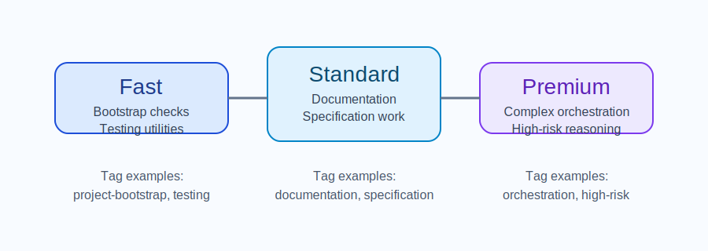

# DS002 LLM Model Strategy

## Introduction

This specification defines the repository's LLM integration strategy. It exists because the runtime must distinguish lightweight bootstrap work from standard documentation or specification tasks and from higher-risk orchestration or reasoning tasks.

## Core Content

All LLM interactions must be routed through `LLMAgent` and exposed through shared runtime configuration. The runtime must maintain task tags for bootstrap, documentation, specification, orchestration, and testing work. The configuration surface must also expose model tiers so callers can separate fast utility tasks from standard baseline work and premium reasoning workloads.

The exact provider names may vary by deployment, but the tier model must remain explicit and manually overridable. The repository example implementation therefore exposes default task tags and model tiers through `skills/achilles_specs/examples/runtimeConfig.mjs` instead of scattering them through ad hoc constants. Documentation and agent guidance must describe the existence of this tier model rather than assuming it can be rediscovered from code.

## Conclusion

Future runtime changes must preserve explicit task tags and an overridable model-tier structure. If the routing model becomes more complex, this specification must be revised in the same change set as the implementation.
