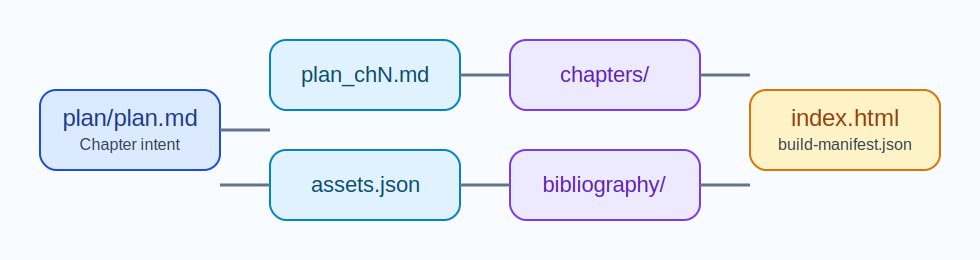

# DS005 Article Build

## Introduction

This specification defines the contract of the self-contained `article_build` skill. It exists because the repository contains executable build logic whose boundaries and validation surface must remain stable during future refactors.

## Core Content

The skill must remain self-contained inside `skills/article_build/`. It must derive output from an explicit article root containing `index.html`, `assets/`, and `plan/`. It must support incremental rebuilds, validate copied SVG assets, verify bibliography support from cached evidence, and regenerate the final HTML plus build manifest from article-owned planning material.

The repository must preserve the existing module boundaries used by the skill: the build orchestrator, bibliography verification, reference catalog loading, HTML rendering, and SVG validation remain separate responsibilities. Host-project source modules under `src/` must not become runtime dependencies of this skill. The repository should continue using the skill's SVG validator when documentation diagrams are edited, because the same readability and containment concerns apply there as well. Projects that use this skill may document their article pipeline as part of project behavior, but they should not create standalone DS files or skill pages under the host project's `docs/` tree whose subject is the imported `article_build` skill.

## Decisions & Questions

### Question #1: Why must `article_build` keep its execution model self-contained instead of depending on host-project modules?

Response: The skill is intended to travel as a reusable build capability. If article generation depends on arbitrary host-project modules or host-project documentation structure, the copied skill stops being portable and becomes harder to audit. Keeping its module boundaries inside the skill folder makes rebuild behavior reproducible and keeps responsibility for article generation explicit.

## Conclusion

Future changes must preserve the skill's self-contained execution model and the current validation surface. Any broadening of scope should be reflected in both the descriptor and the test fixtures.
